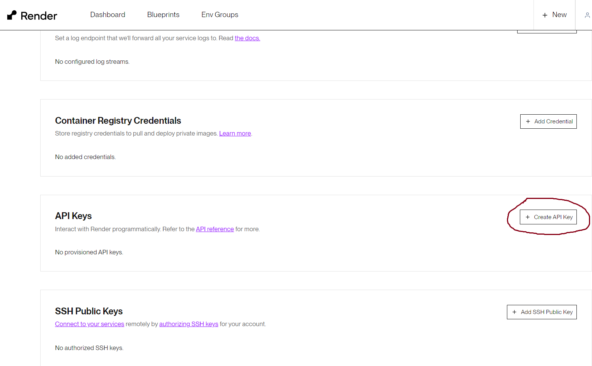

# Render Secrets Sync Github Action

## Introduction

Currently, [Render](https://render.com/) is a relatively new container hosting provider. As a result, support for one-click integrations with other secret managers like Hashicorp, AWS secrets store, etc, are lacking. As a result, we need a way to dynamically update/automate secrets management for Render in a Github action.

This action provides a solution for this problem, by interacting with [Render's API](https://api-docs.render.com/reference/introduction) to programmatically update a Render Service's secrets from a Github action runner, as long as a `.env` file exists.

## Configuring a Service Principal

### Requirements:

- You must generate a Render API Key for the user that holds the service.
- You must create, or have a Render Service running, with a UNIQUE name (to all other services)

### Steps:

1. Go [here](https://render.com/) and login
2. Go to your account settings
3. Scroll down, and create an api key

##### Service Princpal Page Example



## Action Usage

### Quickstart

```yaml
name: Render Sync Secrets
uses: aasmal97/RenderSecretsSync@v1.0.0
with:
  ENV_FILE_PATH: "./.env"
  RENDER_API_KEY: ${{ secrets.RENDER_API_KEY }}
  RENDER_SERVICE_NAME: "example-service"
```

### Inputs:

- `ENV_FILE_PATH`: `string` _(required)_
  
  The file path to the .env file that we will read to update render on

- `RENDER_API_KEY`: `string` _(required)_
  
  Render API key, which we will use to make requests to Render

- `RENDER_SERVICE_NAME`: `string` _(required)_
  
  Render service name, that identifies the service/s we will target, to update secrets on. This must be unique if you want to target ONE service! If you have more than one service that shares the same name, the changes will occur on ALL of them.

- `DELETE_ALL_NOT_IN_ENV`: `boolean` _(optional)_
  
  Delete all secrets not found in the .env file.

- `DELAY_DEPLOY_AFTER_SECRETS`: `string | number` _(optional)_

  Delay deployment by this many milliseconds after secrets have been updated. Useful when using Render's auto-deploy feature, that triggers immeaditely after a designated branch is updated. 
   
  This will COLLIDE with this action's attempt to update secrets. However, setting this delay, can avoid this collision on Render, since the service will not deploy on the Github Runner, until after the specified time. 
  
  Note: Github does have an action runner limit (6hrs) that may need to be modified, if Render deployment takes longer than this

## Limitations

- The API Key must be configured on a Render account, instead of a specific Render service. This limitation is imposed by Render themselves, and therefore can't be support more granular access (i.e API Key for only a specific service).

- Be aware that although we allow for ANY amount of services, to be updated with ANY number of secrets, we are limited by Render's API rate limits. We grab services matching a name, at intervals of 100, and secrets on that service, also, at intervals of 100. If you exceed these more than 5, this action will attempt to update all the services or secrets returned, but the action may throw a rate-limit error.

- This action can only run in **ubuntu** environments. It is not supported in darwin or mac. This is due primarily to ubuntu being the most common environment for Github action runners, but it is also due to my lack of hardware and time. However, in the future, support can be added if it is seen as a good or necessary feature.

## Contributing

Anyone is welcome to contribute, simply open an issue or pull request. When opening an issue, ensure you can reproduce the issue, and list the steps you took to reproduce it.

### Development Environment

To run the development environment, ensure the following are configured properly, and your are running the appropiate commands.

#### Requirements

- [Docker](https://docs.docker.com/engine/install/) installed on your machine. It will provide the virtual environment needed to run a Github Action
- [nektos/act](https://github.com/nektos/act) installed. This is the software that uses Docker to create a container, that resembles a Github Action Environment for testing
- Have a package manager installed (i.e, npm, yarn, etc)
- Create a Render Account
  1. Go [here](https://render.com/) and create an account
  2. Create a dummy service
  3. Go to **Account Settings**, then go to **API Keys** and create a dummy api key.
     - **Save** the **_RENDER_API_KEY_** value in a `my.secrets` file in the following path `test/workflows/my.secrets`. `nektos/act` will use this to run the virtual github action.
     - Note: The `my.secrets` file follows the same form/syntax as a regular `.env` file.
  4. Create dummy `.env` file with new secrets.

#### Running Dev Environment

1. Run `npm i`
2. Run `npm run dev`
